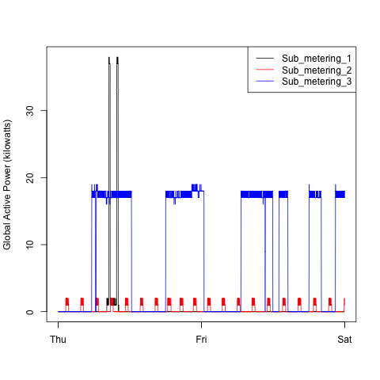
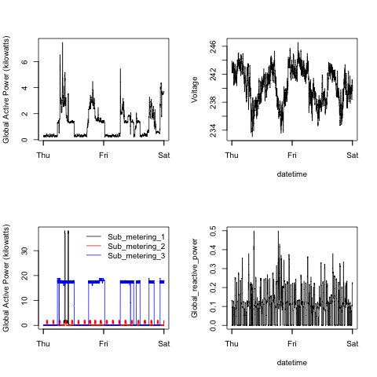

# ExploratoryDataAnalysis

This repository contains the files that satisfy the requirements for Assignment 1 in Exploratory Data Analysis.

##Plot 1
The code that generates Plot 1 is in [plot1.R](plot1.R).

##Plot 2
The code that generates Plot 2 is in [plot2.R](plot2.R).

##Plot 3
The code that generates Plot 3 is in [plot3.R](plot3.R).

##Plot 4
The code that generates Plot 4 is in [plot4.R](plot4.R).
